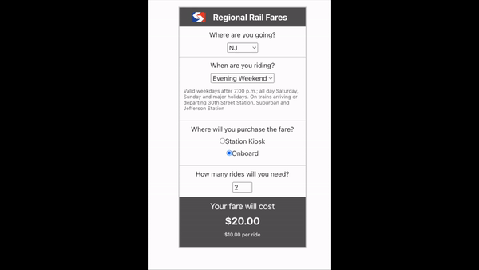

# My SEPTA Rail Fare Calculator Challenge

## Applicant Info
- My name is Nick. I had a lot of fun building this widget with TypeScript React. I have been taking every opportunity to practice defining types and interfaces even if it isn't completely necessary.

---
## Demo the Widget
1. clone the repo
2. open a terminal
3. make sure you are in the root directory of this repo `code-challenges`
4. run these commands
```
npm install
```
```
npm start
```
5. Open [http://localhost:3000](http://localhost:3000) to view it in the browser.
6. To close server processes, enter `ctrl + c` on your keyboard
---
## My Process
1. study the data and wireframe
    - num of form sections
    - how fare total is calculated
    - how certain fields are influenced by others
2. declare state and create controlled inputs
    - use JSON file as test data
    - test that calculation is correct
3. add labels
4. add helper notes
    - test to determine where it is unclear how the program is working
5. add styling
6. test and determine "nice to haves"
    - example: pricing for individual rides always displayed

## If Given More Time
1. ensure error prompt where no radio button is selected
2. handle when data is not fetched or no schedule data exists
3. add loading animation
4. add transitions or set height for the widget so that widget doesn't grow and shrink
