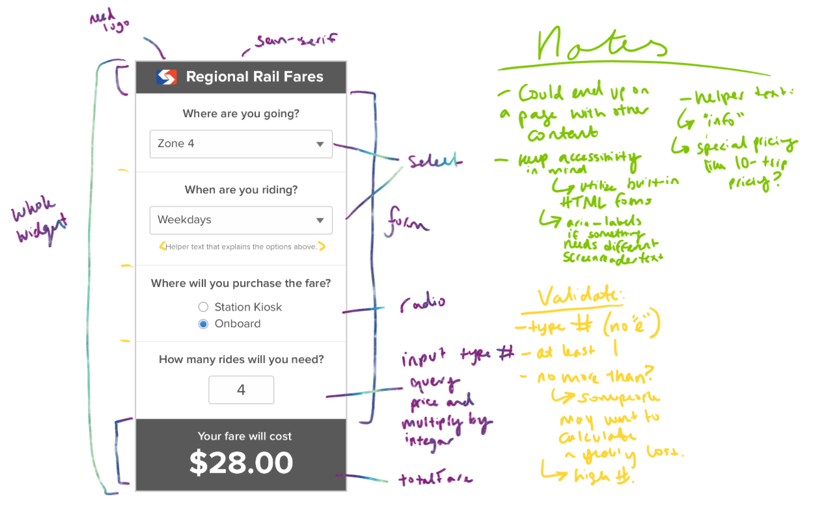

# Whit Minson SEPTA Fare Calculator Widget Submission

## Technologies
- React
    - `npx create-react-app` command
    - I understand this is deprecated but I wished to have a simple react app for the purposes of this challenge.  

## Planning
### Brainstorming

- I wanted to look through the provided resources of SEPTA's site and parse through the `fares.json` to make sure I understood how the widget should perform.
> This whiteboarding would not usually be client/team-facing and below I have cleaned up the information that would be more appropriate to share.

| Price Factors             | Choices                           |
|---------------------------|-----------------------------------|
| Station where trip starts | *always going to be city center            |
| Station where trip ends   | `CCP/1`, `Zone 2`, `Zone 3`, `Zone 4`, `NJ` |
|Day/Time of the Week       | `anytime`, `weekday`, `evening_weekend` |
| Payment Method            | `advance`, `onboard`                  |

### Widget Planning

### Component Planning
- `<CalculatorWidget />`
    - Can be used for different calculations beside the Rail fare, like their Pass program, Airport line fares, or Share Ride Fares. 
    - `<CalculatorHeader />`
        - Displays logo and title
    - `<RailForm />`
        - Includes the form, selects, radio button, and input field. 
        - controlled inputs with state variables.
    - `<FareResult />`
        - "Your fare will cost" 
        - calculation made after querying for the right fare times the number of rides.

## Implementation