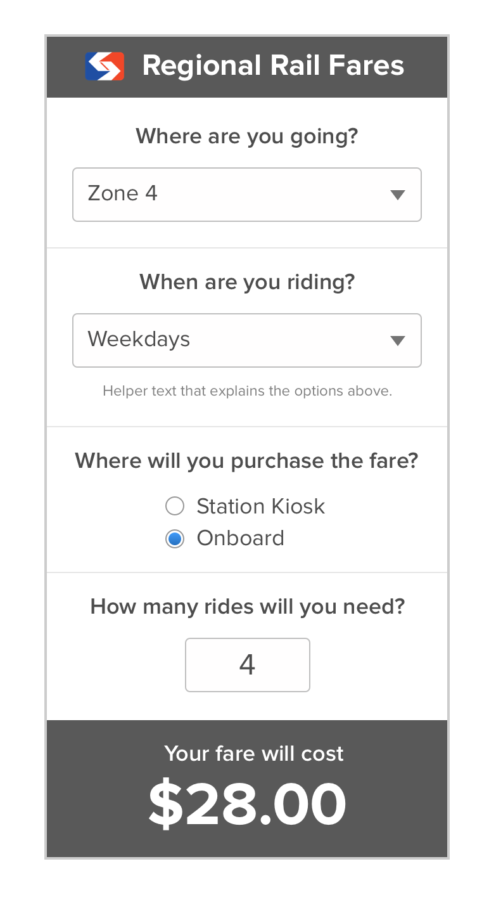

# SEPTA Rail Fare Calculator Challenge

Hello, hopeful Think Company development team member!

Thank you for taking time to help us assess your front-end development skills. Part of the work we frequently are tasked with is combining complex business data with our design team's fresh new interfaces. Our development team makes these come to life with semantic, accessible HTML, CSS, and JavaScript. All of our philosophies are documented in [our development standards](https://standards.thinkcompany.dev/).

Your challenge is to create an interactive widget for calculating SEPTA Regional Rail fare prices. (In case you're not familiar with Philadelphia's preeminent mass transit agency, here are all the railroads in map form.)

When you take regional rail in and out of the city, the fare price is affected by where you purchase the ticket, when you ride, and how far you travel. You can learn more about the details on [SEPTA's website](http://www.septa.org/fares/ticket/index.html) -- or trust that we've correctly compiled this information into this [JSON file](fares.json). We'd like you to make this information easier to understand by making an interactive fare purchase widget, illustrated in the screenshot below.

## Instructions
* Visit our [careers page](https://www.thinkcompany.com/careers/) and apply for one of our open positions so we have your contact information along with your pull request.
* Develop the HTML and CSS for the widget seen in the screenshot above. Feel free to make this responsive, and keep accessibility in mind: screen readers should handle the form, helper text, and any other important content well.
* Assume that your code would be handed off to a back-end developer for integration. It could end up on a page with other content and widgets, so keep this in mind when you are making decisions about naming conventions.
* Write JavaScript to request [fares.json](fares.json) via AJAX and populate the widget with live data. End users should be able to see the fare total update when they use the widget controls. Think hard about the data format before starting - what does "anytime" mean, and what's the most elegant way to let users know about special pricing for items like 10-trip tickets?
* We plan on looking at the balance of your HTML, CSS, and JS, but we'd rather see a partially-styled working prototype than a pixel-perfect widget that isn't doing fare calculations. Try to balance your time appropriately!
* It should go without saying - please comment your code to state any assumptions or decisions you're making during this assignment -- or just to say hi. :-)

## Requirements
* *Browser Support*: Microsoft Edge, Google Chrome, Firefox, Safari for iOS, and Chrome for Android.
* *Libraries & Frameworks*: You are welcome to bring in JavaScript libraries (like jQuery) or frameworks (like Angular, React or Polymer). You may also author your JS with vanilla DOM methods, as long as they are compatible with the browser requirements. Please don't include an entire CSS framework like Bootstrap -- we want to see your HTML and CSS, not theirs.
* *Standards*: Your solution should be valid, semantic, accessible, and performant. To get an idea of what how we're doing things, please feel free to review [our development standards](https://standards.thinkcompany.dev/).
* *Time*: We don't expect you to overexert yourself to deliver a perfectly finished product, but want to allow you take the time you think you need to show your stuff. We recommend spending about an hour, but let us know how much time you spend if you decide to take more time.
* *Submission*: Fork this repository and make a pull request for us to review your code. If you're not familiar with git or Github, you can download this repo and send us a ZIP file when you're done.

## Resources
* [Think Company Development Standards](https://standards.thinkcompany.dev/)
* [SEPTA Fares](http://www.septa.org/fares/ticket/index.html)
* [SEPTA Logo (SVG)](https://commons.wikimedia.org/wiki/File:SEPTA.svg)

# Getting Started with Create React App

This project was bootstrapped with [Create React App](https://github.com/facebook/create-react-app).

## Available Scripts

In the project directory, you can run:

### `npm start`

Runs the app in the development mode.\
Open [http://localhost:3000](http://localhost:3000) to view it in the browser.

The page will reload if you make edits.\
You will also see any lint errors in the console.

### `npm test`

Launches the test runner in the interactive watch mode.\
See the section about [running tests](https://facebook.github.io/create-react-app/docs/running-tests) for more information.

### `npm run build`

Builds the app for production to the `build` folder.\
It correctly bundles React in production mode and optimizes the build for the best performance.

The build is minified and the filenames include the hashes.\
Your app is ready to be deployed!

See the section about [deployment](https://facebook.github.io/create-react-app/docs/deployment) for more information.

### `npm run eject`

**Note: this is a one-way operation. Once you `eject`, you can’t go back!**

If you aren’t satisfied with the build tool and configuration choices, you can `eject` at any time. This command will remove the single build dependency from your project.

Instead, it will copy all the configuration files and the transitive dependencies (webpack, Babel, ESLint, etc) right into your project so you have full control over them. All of the commands except `eject` will still work, but they will point to the copied scripts so you can tweak them. At this point you’re on your own.

You don’t have to ever use `eject`. The curated feature set is suitable for small and middle deployments, and you shouldn’t feel obligated to use this feature. However we understand that this tool wouldn’t be useful if you couldn’t customize it when you are ready for it.

## Learn More

You can learn more in the [Create React App documentation](https://facebook.github.io/create-react-app/docs/getting-started).

To learn React, check out the [React documentation](https://reactjs.org/).
